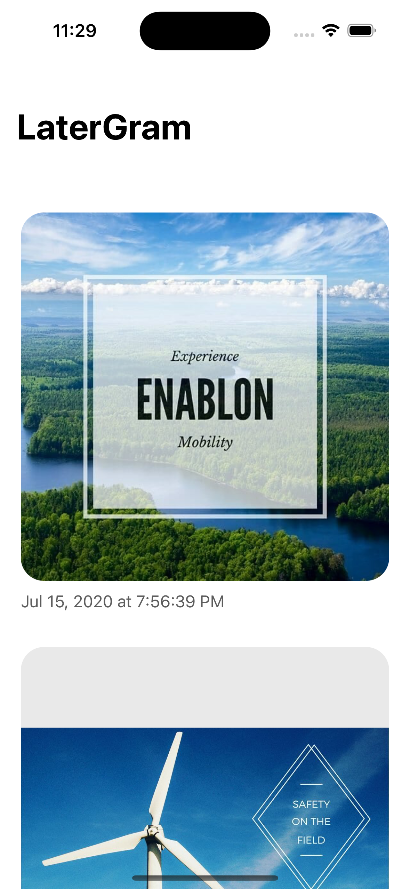
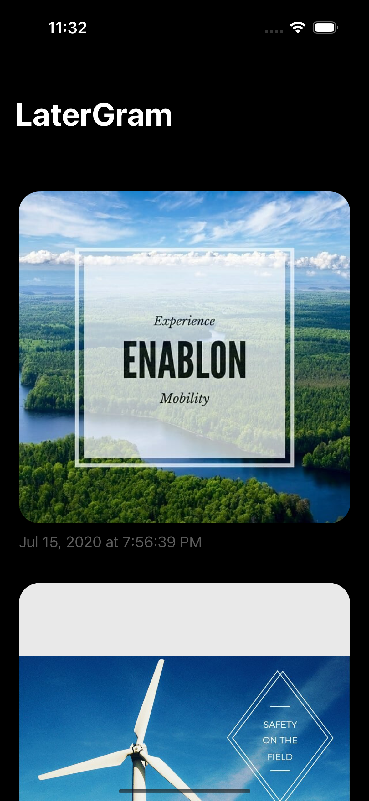
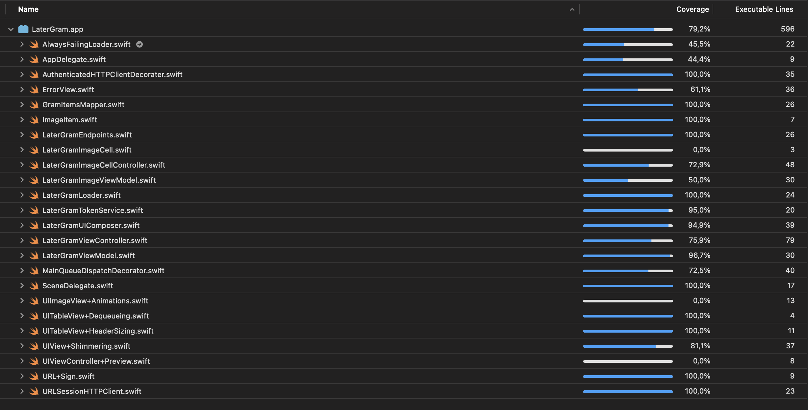

## LaterGram
Is a mobile app with one view showing the list of the most recent photos and albums posted on Instagram with the following guidelines:

## Setup
- Clone the Repo
- The project has been build with Xcode Version 14.0.1

*MUST DO* Rename `sampleConfig.json` to `config.json` and update the access_token with a valid token

## Architecture
- MVVM (Model View ViewModel) + Composition layer

## How to run the application
- Open `LaterGram.xcodeproj`
- use the key combination `ctrl + R` to run the application

## Screenshots
### Normal states

  

### Error states

## Tests
- Open `LaterGram.xcodeproj`
- use the key combination `ctrl + U` to run the unit tests

### Coverage

## Improvements
- Caching layer to eliminate fetching images every time
- Use a UICollectionView to allow for listing images and scrolling within an album
- Switch to having one HTTPClient that allows for cancelling requests

## ChangeLog
 - [CHORE: Documentation + CleanUp](https://github.com/DevAgani/LaterGram/pull/3)
 - [Feature: Presentation Layer](https://github.com/DevAgani/LaterGram/pull/2)
 - [Feature: Image Feed Loader](https://github.com/DevAgani/LaterGram/pull/1)

Built with `XCode Version 14.1` 
